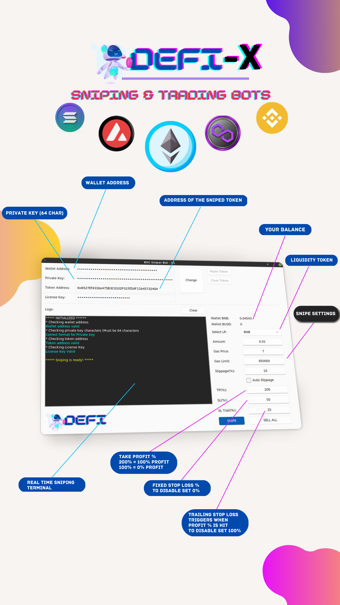

<div align="center">
  
  <h1>POLY-X</h1>
  <h2>THIS NEW VERSION IS FOR POLYGON ONLY, WORKING ON ADDING ALL MAIN CHAINS!</h2>
  <p>Snipe New Tokens on all POLYGON Dexes within 1 millisecond</p>
    <p>ALL CREDITS GO TO DEFIMASTERD AND HIS BSC SNIPING BOT</p>
  
  [](https://www.npmjs.com/package/@faker-js/faker)
  [](https://opencollective.com/fakerjs#section-contributors)
  [](https://opencollective.com/fakerjs)
  
  <p align="center">
  
  
  
</p>
  
  <p>BSC Sniping Bot version: https://github.com/DeFiMasterd/PancakeX-ASTRA-V2-BSC-Sniping-Bot</p>
  <p>AVAX Sniping Bot version: https://github.com/DeFiMasterd/PancakeX-ASTRA-AVAX-Sniping-Bot</p>
  <p>ARBITRUM version! much love: https://github.com/Yapote/ARBITRUM-SNIPING-BOT-ARBX</p>
  <p>ETH sniping bot: https://github.com/Yapote/ETHEREUM-SNIPING-BOT-ETHX</p>
</div>




## 🚀 Features

- 💌 Auto approve
- ⏰ Buy early token gems with custom gas fee, slippage, amount. Bot waits for liquidity (DYOR)
- 🌏 Sell tokens with your custom increase in price, like 50%, 100%, 200%.
- 💸 Contains Stop loss (Set SL% to 0 for no Stop loss, and TP% to 100% for no Trailing stop loss), Trailing Stop loss (for maximum profits) and more. Set TP% (Take profit %) to 120% for 20% gain, 100% is the base so 0x, 200% is 1x on your investment
- 💸 Open source, with free node services (Literally don't have to pay anything to run this bot)
- Enjoy and leave a star, if you like it!

> **Note**: Please install a code visual tool first such as Visual Studio Code as it will help you set up this bot within 4 minutes
> Please do not use sniping bots that offer .exe files as these are 99% scams
## 📦 Install

```bash
1. Download python3.7+ for your PC from python org, extract the ABI and themes zip into the folder with the bot
2. Open terminal in the bot folder and type "pip install -r requirements.txt" / this will install all modules required to run the bot
3. In the same terminal type "python3 astra-polygon.py"

```
## 💎 Successfull 40,000k snipe the other day :)


## 🤝 Sponsors

PancakeX is an MIT-licensed open source project with its ongoing development made possible entirely by the support of these awesome backers

## 📘 Credits

Thanks to all the people who already contributed to making this PancakeX better!


## 📝 Changelog

Detailed changes for each release:

#### • Version v1 [release] - 4 months ago
#### • Version v2 [fixed minor bugs, added more custom settings] - 3 months ago
#### • Version v2.1 [commented code, new functions & more] - 3 months ago
#### • Version v2.2 [added 9 new functions, custom settings page] - 1 month ago
#### • Version v2.3 [fixed minor bugs] - 4 weeks ago
#### • Version v2.4 [minor changes] - 3 weeks ago
#### • Version v3 [global changes, added new functions, log inside the terminal, CROSSCHAIN support] - 1 week ago
#### • Version v3 [ADDED dark mode] - 2 days ago

## 🔑 License

[MIT]
